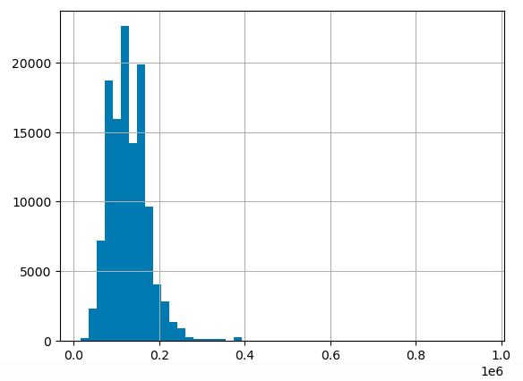
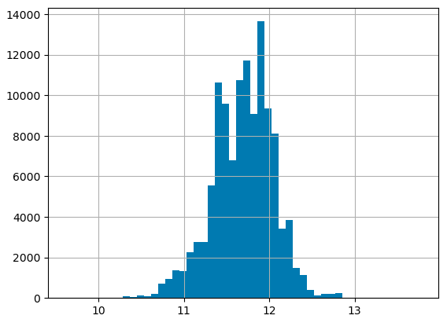

# Predicting Salary Based on Job Features

## Project Overview

This document describes a **Random Forest Regressor** model designed to guess how much a job might pay based on certain characteristics of the job, like its title, where it is located, what skills it requires, and if it provides insurance or not. The project uses Python, a popular programming language, and several specialised tools (libraries) to handle data and build the predictive model.

## What is a Predictive Model?

A predictive model is a statistical tool that uses mathematics to predict outcomes. For this project, the outcome is the salary for a job. The model looks at past job data and tries to learn patterns that can tell us how much new jobs are likely to pay.

## Data Description
Four main types of data (stored in CSV files) were used to describe different aspects of jobs:

- `skills_job_dim.csv`: Links job IDs to specific skill IDs for those jobs.

 

- `skills_dim.csv`: Lists skills unique IDs and type.

 

- `job_postings_fact.csv`: Contains detailed information about job postings, like the job's title, location salary offered, if it offers health insurance, etc.

 

- `company_dim.csv`: Information about companies that have job postings and its links.

 

## How the Data Was Prepared (Feature Engineering)

Before the predictive model was built, the data needed preparation:

- **Target Encoding**: Job locations and skills, which are words, were converted into numbers that a computer could work with. This encoding technique involves replacing categorical data with average target values. For instance, if 'job location' is a feature, each location is replaced by the average salary of jobs in that location. .

 

- **One-Hot Encoding**: Certain job features like job titles were transformed into a binary format, where each category is represented by a unique combination of zeros and ones, allowing the model to easily differentiate and assess the impact of each feature.

 

- **Log Transformation**: Skewness in data, where many entries clustered at the lower end and a few were significantly higher, was reduced. Salaries were converted to a logarithmic scale, enabling the model to handle variations more effectively and uniformly, which led to more accurate predictions.

 
 

Before log transformation:

 

 

After log transformation:

 

 

## Building and Testing the Model

 

- **Splitting the Data**: The data was divided into two parts: 80% for building the model and 20% for testing its accuracy. This common split ratio allows for comprehensive training while reserving enough unique data to reliably assess the model's performance.

 

- **Random Forest Regressor**: A Random Forest Regressor was used, which consisted of many decision trees working together to make a guess. A decision tree is a flowchart-like structure that aids in decision-making.

 

- **Scaling**: The features were standardised so that large numbers in one feature did not dominate others.

 

- **Evaluating the Model**: Root Mean Squared Error (RMSE) was used to measure how close the model’s predictions were to the actual salaries. Generally, lower RMSE indicates better accuracy. For this model, thr Root Mean Squared Error on Test Set = 0.293 on a logarithmic scale, which shows good model accuracy.

## Results and Outputs

 

**Feature Importance**: It was identified which job features (like location or skills) had the most influence on salary predictions. The importance of each category was quantified as follows:

 

  - **Job Location**: 0.41156 (41.156%)
   
  
  - **Job Title**: 0.28440 (28.440%)
    
   
  
  - **Skills**: 0.26986 (26.986%)
    
   
  
  - **Job Health Insurance**: 0.03418 (3.418%)

This data shows that job location had the highest impact on salary predictions, followed by job title and skills, indicating their significant roles in determining salary levels. Job health insurance had the least influence, which suggests it is a less critical factor in salary variability.

 

**Predicting Salary**: The model was demonstrated on how to predict salaries based on certain job features. Using the following example job features, the model was able to estimate the salary:

   
  
  - **Job Title**: Senior Data Scientist
  
     
    
  - **Job Location**: Mountain View, CA
  
     
    
  - **Skills**: java, r, sas
  
     
    
  - **Job Health Insurance**: true
    
       

 Based on these inputs, the predicted yearly salary was calculated to be $193,470.04. This demonstrates the model's capability to accurately predict salaries using real-world job characteristics.

 

